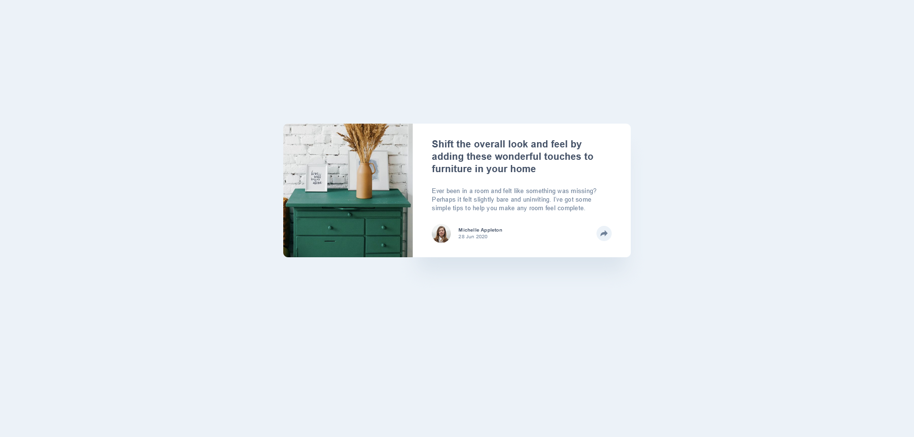
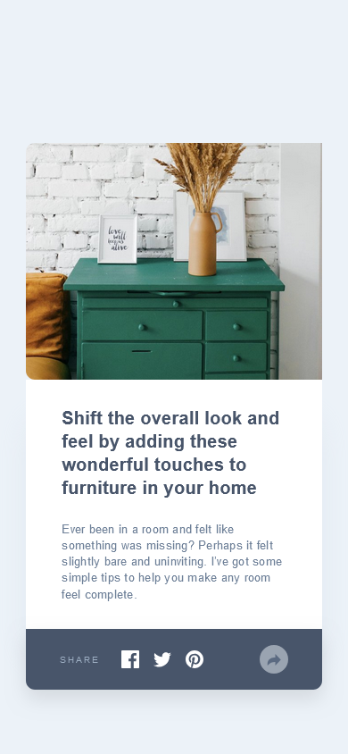

## Article Preview Component — Frontend Mentor Challenge

A responsive, interactive component built with semantic HTML, modern SCSS architecture, and modular JavaScript.
This project includes a dynamic tooltip toggle triggered via JavaScript — practicing clean separation of concerns and progressive enhancement.

[🔗 Live Demo](https://kellenkjames.github.io/article-preview-component/)

---

## Features

- Responsive design for mobile and desktop layouts
- Semantic, accessible HTML5 structure
- Modular SCSS with design tokens and utility mixins
- Dynamic tooltip toggle using modern ES6 JavaScript modules
- Component-based architecture with separation of concerns (MVC-lite)
- BEM naming convention for scalable styling
- TypeScript refactor planned (post-MVP)

---

## Tech Stack

- HTML5
- SCSS (BEM, Tokens, Mixins)
- JavaScript (ES6+ Modules)
- Git / GitHub
- GitHub Pages (Deployment)
- Figma (Design Reference)

---

## Screenshots

| Desktop                                                 | Mobile                                                |
| ------------------------------------------------------- | ----------------------------------------------------- |
|  |  |

---

## Project Structure

<pre> ``` article-preview-component/ ├── index.html ├── assets/ │ ├── images/ │ └── screenshots/ ├── src/ │ ├── js/ │ │ ├── model.js # Tooltip state (optional) │ │ ├── view.js # DOM selection + UI rendering │ │ ├── controller.js # Event handling, toggle logic │ │ └── main.js # Entry point, init app │ └── styles/ │ ├── abstracts/ # Tokens, mixins, breakpoints │ ├── base/ # Reset + global styles │ ├── components/ # Tooltip, button styles │ ├── layout/ # Card structure layout │ └── main.scss ├── style.css # Compiled CSS output └── README.md ``` </pre>

---

## Getting Started

1. Clone the repository:
   `git clone https://github.com/yourusername/article-preview-component.git`

2. Navigate to the project directory:
   `cd article-preview-component`

3. Compile SCSS to CSS (if using the CLI):
   `sass src/styles/main.scss style.css`

4. Open `index.html` in your browser to preview the layout.

---

## ⏱️ Time Estimates

| Task                             | Time Spent |
| -------------------------------- | ---------- |
| Initial Setup & File Scaffolding | 1 hr       |
| Layout & Styling (HTML + SCSS)   | 2 hrs      |
| Tooltip Logic (JS Controller)    | 2 hrs      |
| Responsive + Mobile QA           | 1.5 hrs    |
| Final Refactor & QA              | 1.5 hrs    |
| **Total**                        | **~8 hrs** |

## Key Learnings

- How to separate JS logic into MVC-inspired modules (model, view, controller)

- Cleanly structuring DOM interaction logic in modern JavaScript

- Writing reusable SCSS with tokens, mixins, and responsive utilities

- Building for progressive enhancement (functionality without breaking layout)

- Laying the foundation for Angular-like thinking (modularity, component mindset)

## Improvements (If time allowed)

- Refactor JavaScript into TypeScript for stronger typing and maintainability

- Add fade-in animation to tooltip for smoother UX

- Improve accessibility with `aria-expanded` and keyboard navigation

- Add test cases for tooltip toggle logic (e.g. Jest or manual console logging)
